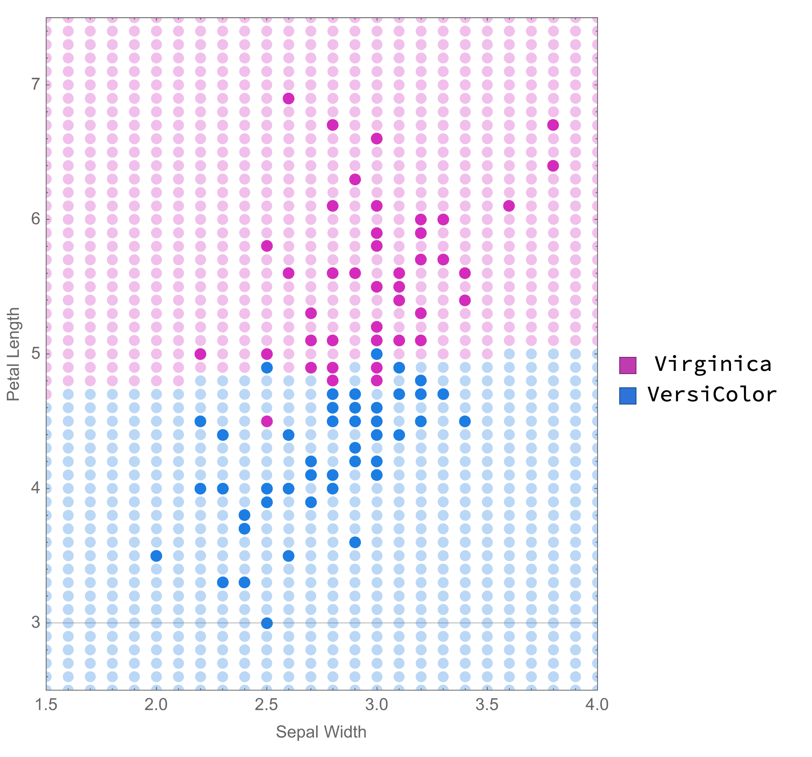

# Flower classification with support vector machine
SVM trained on sepal width and petal length to determine flower type.  
Simple visualisation of the effects of SVM parameters on an overfit/underfit/ideal model.

